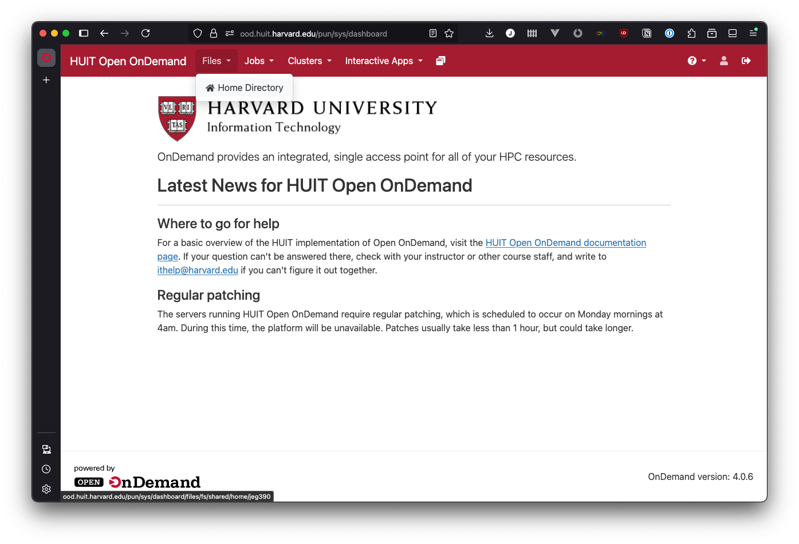
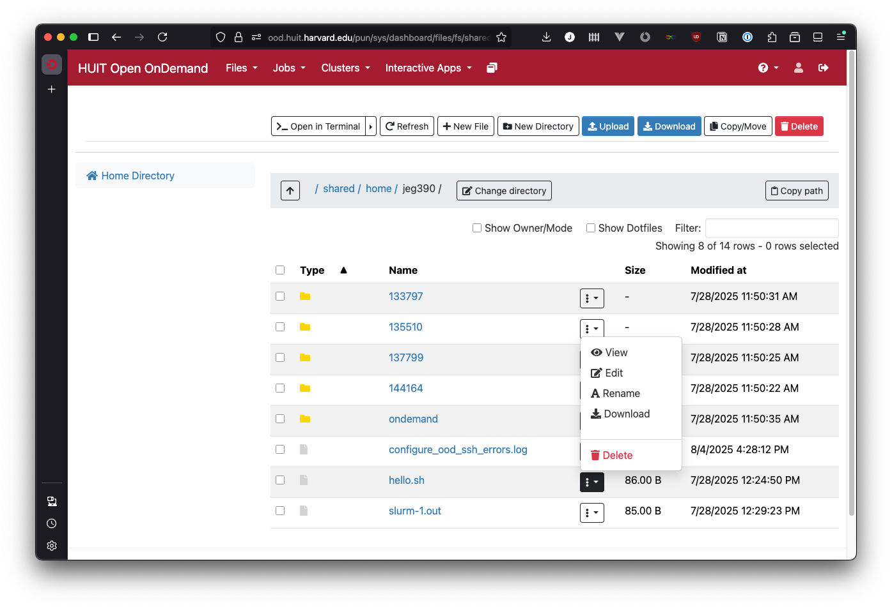
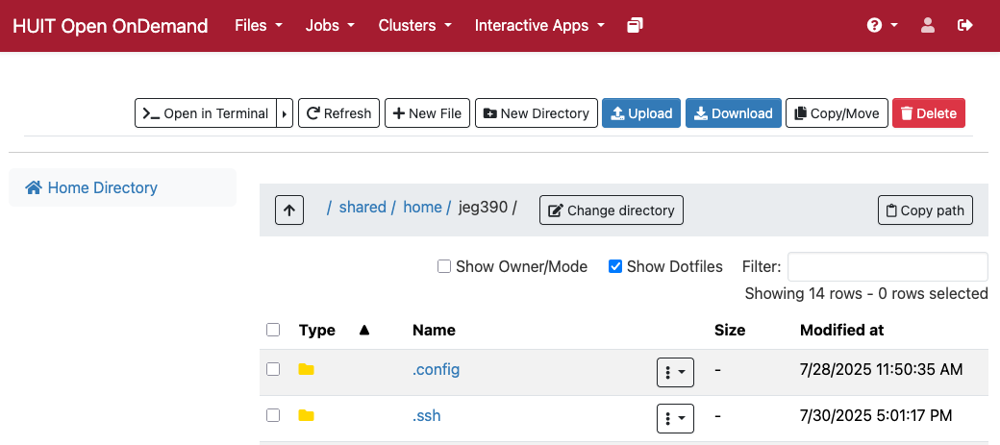

# File Management

In Open OnDemand, you can access files in your home directory through a browser, rather than a terminal or through an application within Open OnDemand. This allows you to quickly upload or download files, and to make simple edits to text files in your home directory.

To get to your files through the browser, use the Files dropdown menu in the bar at the top and click on "Home Directory".

In the home directory tool, you can upload, download, or manipulate your files.

To view certain hidden files and folders, you may need to check the box for "Show Dotfiles". This reveals hidden files used by the system, such as the directory containing your SSH keys and the `.bashrc` file that configures your terminal.

