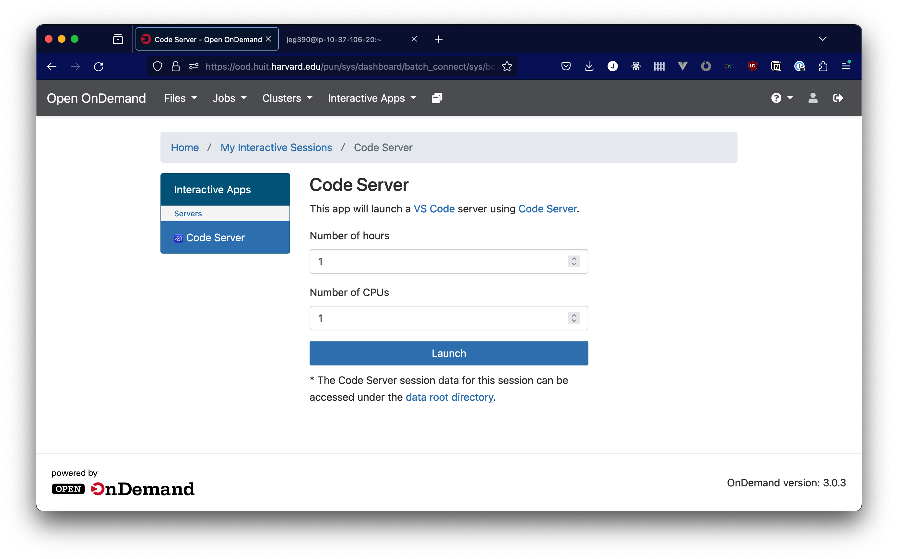

# Interactive Apps

There are a number of interactive apps available in HUIT Open OnDemand. Which
one you use will be determined by which class you are in. These apps have some
common configuration elements that you'll see when launching any application.

In this screenshot, the configuration for the launch of the Code Server app,
you'll see that you can specify a duration for which you want to have the app
available, as well as the number of CPUs you want to allocate to the job.

When selecting the duration for your session, choose a length of time a bit
longer than the amount of time that you intend to work. The time cannot be
extended, but you can release the resources that your session uses by exiting
the interactive app from within its interface (the way you do this differs from
app to app) or canceling the slurm job running it.

When selecting the number of CPUs allocated to your job, allocate what works
well for the application you're using. The benefits of allocating more resources
to your session are pretty self-explanatory, but if you allocate a smaller
number of CPUs, you have a better chance for your job to run on an existing
compute node with available capacity, rather than having to wait several minutes
while a new node comes online.

In addition to these general settings, we also have application-specific
documentation for the following apps:

- [JupyterLab (Spack)](jupyterlab-spack.md)
- [Remote Desktop (ROS / Gazebo / Matlab)](remote-desktop-ros.md)
- [Code Server](vscode-app.md)
