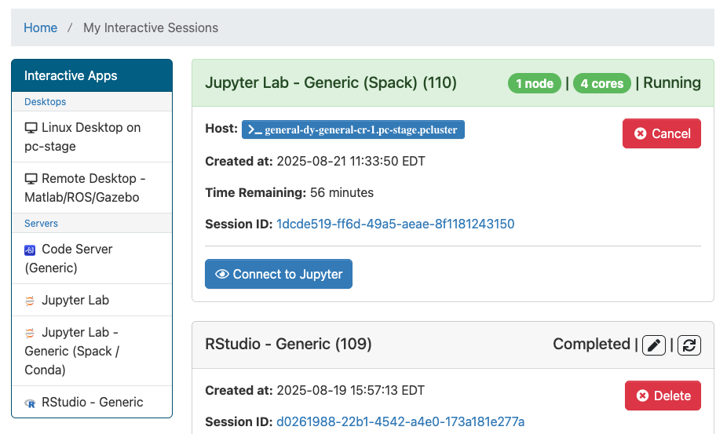

# Jupyter Lab

For Python (and occasionally for R) programming, we provide a Jupyter Lab
interface. Jupyter apps are configured for each course using HUIT Open OnDemand,
so as a student or instructor, you'll see a Jupyter app with your course code
available in your OnDemand Dashboard.

You'll see the standard options available to other [interactive
apps](interactive-apps.md), allowing you to set how much time you need for your
session and how many CPU cores you need. Some Jupyter apps with special
configurations won't give you options for numbers of CPU cores.

Some Jupyter apps are also configured with a toggle between a "Course"
environment and a "Global" environment. In most cases you will want to choose
the "Course" environment, with the "Global" environment as a fallback. That's
because the "Course" environment is managed by course instructors, and will have
additional software configured by the teaching staff. The "Global" environment
is a fallback environment managed by HUIT with the initial software
configuration from the beginning of the term. While it should be stable, it may
not include all of the same software as the "Course" environment.

## Launching the app

When the Jupyter app is ready for launch, you should be able to get into the
Jupyter environment by clicking on the blue "Connect to Jupyter" button that
appears when the app is ready to launch. 

If you are presented with a Jupyter
login screen after clicking this button, that indicates that there is a problem
with the app configuration, and you should contact
[atg@fas.harvard.edu](mailto:atg@fas.harvard.edu) for support.

## Slurm commands from the Jupyter Lab app

The Jupyter Lab app can be set up in different ways, so whether Slurm commands
are available will depend on the implementation used in your course. If slurm
commands are not available in your Jupyter Lab app, the app description will
have a note to that effect.

If Slurm commands are available, they will function slightly differently from
how they work in the terminal app through the OnDemand dashboard, since the
Jupyter Lab app runs as a slurm job itself. For instance, `srun` will not
automatically create a new job, since it is being run in an existing job
context. To create a new Slurm job from within an app running in its own Slurm
job, you will need to first allocate compute resources with `salloc`, or use
`sbatch` instead. It may also be necessary to use `--export=ALL` when running
`srun` commands from the VS Code terminal. If you find other problematic slurm
behavior from the VS Code interface, especially if you have found a workaround,
let us know by opening an issue in the repository for this documentation:
[github.com/Harvard-ATG/huit-ondemand-user-docs/issues](https://github.com/Harvard-ATG/huit-ondemand-user-docs/issues)
