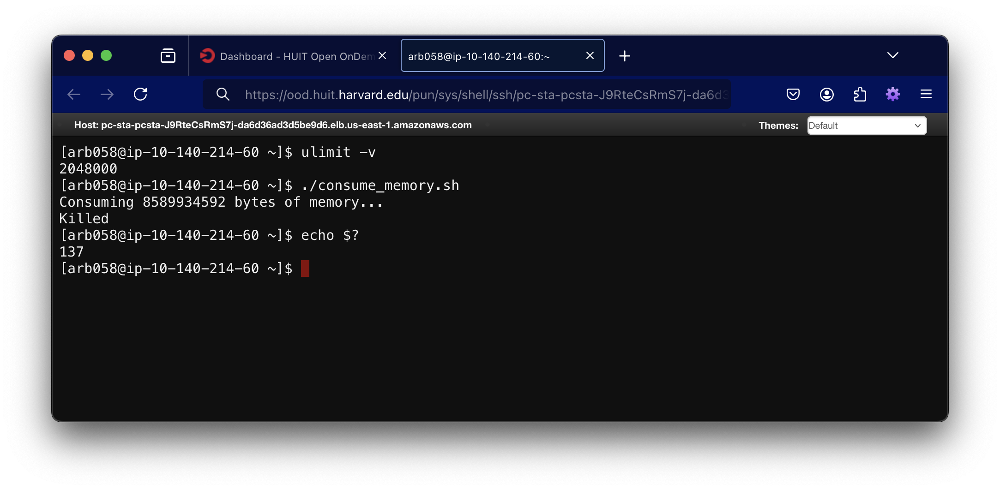

# Terminal App

Open OnDemand provides access to a browser-based terminal. This terminal runs on a _login node_ in the compute cluster, rather than a _compute node_, so the terminal environment should not be used directly for computation.

The terminal should be used to queue batch or interactive jobs with slurm commands like [sbatch](https://slurm.schedmd.com/sbatch.html), or to perform simple, non-intensive tasks in your home directory.

!!! danger "Login nodes are not for computing!"
    Login nodes are shared among many users and therefore should not be used to run computationally intensive tasks (R, python, etc). Those tasks should be submitted to the slurm scheduler which will dispatch them on compute nodes.

To access the terminal app, go to the "Clusters" menu item and click on "academic Shell Access". This should open a new tab with a terminal interface into an Amazon Linux 2 environment.

When you connect to the terminal, you should see something similar to the screenshot below. If you are prompted for a password, that indicates that a problem has occurred, so please reach out to support via [atg@fas.harvard.edu](mailto:atg@fas.harvard.edu)

Be aware that compute intensive jobs that run on the login node may be killed by the system automatically. If this happens, you will see output in the terminal that says the program was _Killed_. You can check the [exit status](https://www.gnu.org/software/bash/manual/html_node/Exit-Status.html) to confirm the reason by using the `$?` variable. A value of 137 indicates the program was killed because it used too much memory. The screenshot below shows an example of a program that was limited to 2GB of memory, but attempted to consume 8GB (note that actual limits on the login node may vary).

