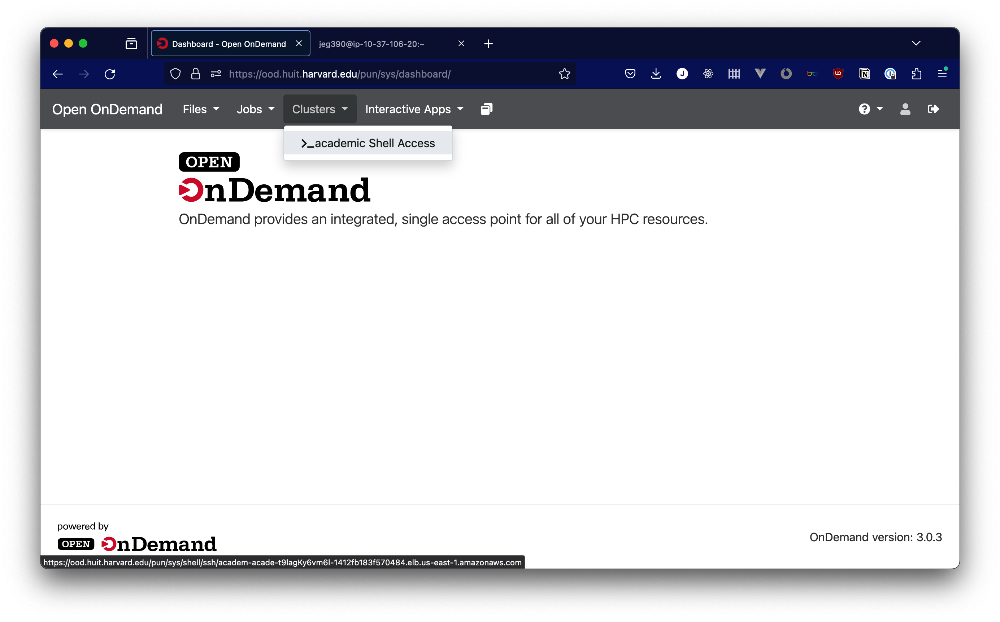
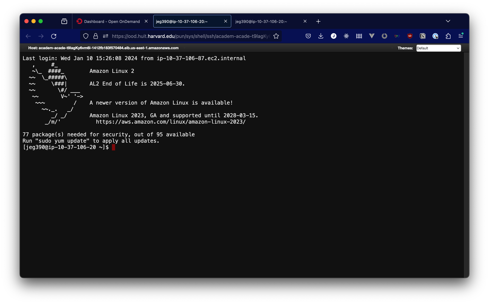

# Terminal App

Open OnDemand provides access to a browser-based terminal. This terminal runs on a login node in the compute cluster, rather than a compute node, so the terminal environment should not be used directly for computation.

Instead, the terminal should be used to queue batch or interactive jobs with slurm commands, or to perform simple, non-intensive tasks in your home directory.

To access the terminal app, go to the "Clusters" menu item and click on "academic Shell Access". This should open a new tab with a terminal interface into an Amazon Linux 2 environment.

When you connect to the terminal, you should see something similar to the screenshot below. If you are prompted for a password, that indicates that a problem has occurred, so please reach out to support via [atg@fas.harvard.edu](mailto:atg@fas.harvard.edu)

