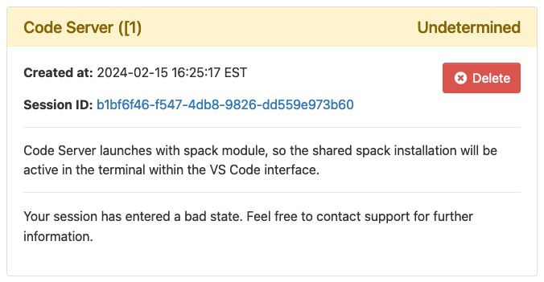

# Troubleshooting

## "Undetermined" State Interactive Apps

When launching an interactive app, you may see an information card like this one:

If this happens, it is usually because of a problem in your `.bashrc` file. If you use the [dashboard terminal app](terminal.md) to connect to a login node, you should see the full error causing the problem. The error message should point to a solution to apply to your `.bashrc` file, but if you have trouble finding a solution, reach out to [ithelp@harvard.edu](mailto:ithelp@harvard.edu?subject=HUIT Open OnDemand) for further assistance.

With a working `.bashrc` file, interactive apps should start functioning normally. However, sessions that you started will still be running. You can cancel these sessions by first finding their job ID with the `squeue` command in the [dashboard terminal](terminal.md) to see your running jobs with IDs. Then, run `scancel {jobid}` (don't include the curly braces) to cancel the running job.

The the "Undetermined" state cards will also persist in your interactive session history. If you wish to clean them up and remove them, take note of the session ID in the card. You can remove the corresponding file in your home directory with a `rm ~/ondemand/data/sys/dashboard/batch_connect/db/{session_id}` command from the [dashboard terminal](terminal.md) or any interactive app with terminal access.
