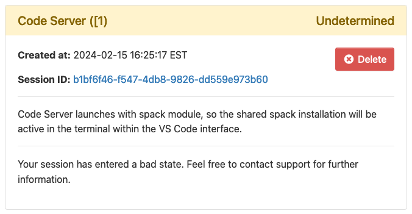

# Troubleshooting

## Most / All Nodes "Down" in a Queue

HUIT Open OnDemand runs in Amazon Web Services (AWS), and all of the compute
nodes are Amazon Elastic Compute Cloud (EC2) instances that are allocated for
use in response to jobs running on the cluster.

That means that unlike in a traditional HPC cluster that runs out of a specific
data center, the compute nodes don't represent specific hardware devices.
Rather, they represent the allocation of compute resources within AWS.

As a result, it's possible for a compute node to be unable to launch because
Amazon does not have compute resources available in the region that we operate
from. This is particularly true for GPU instances, which are in high demand
worldwide and only available to courses with concrete needs for those resources.
When this happens, compute nodes that were marked as "idle" in the cluster are
instead marked as "down". Behind the scenes, the system will periodically try to
launch EC2 instances as compute nodes so that the queued work can proceed. 

This is an important distinction. In a traditional HPC data center, a node
marked as "down" likely has a hardware or software failure that prevents it from
being used. In this system, a node marked as "down" most often means that Amazon
currently lacks the capacity to launch that instance type, and the system will
keep trying to launch it until it succeeds. It could still indicate a problem
with an individual node, but if you're seeing "down" for the majority of a
queue, AWS capacity is the more likely culprit than catastrophic hardware
failure.

Unfortunately, we don't have insight into how much capacity AWS has in different
instance series at different times. This cluster is using the same
infrastructure that is shared by all other AWS customers, making it difficult to
anticipate capacity in advance. Guaranteeing availability requires advance
planning (Amazon recommends 8 weeks) and paying for unused compute resources,
which is why courses use Amazon's on-demand instance capacity.

Several defensive measures are already in place to make this as unlikely and
short-lived a state as possible:

- All queues draw from multiple AWS availability zones, so compute resources can
  come from a number of different Amazon data centers in the same region.
- Where possible, queues are configured with multiple instance types. Some
  courses have requirements that can only be met by certain instance types, but
  we do this wherever we can.
- The system (AWS Parallel Cluster) retries the compute resource request
  periodically so you don't have to resubmit jobs.

### What to do

If you are submitting a batch job, then checking `sinfo` and seeing this state,
just know that your job will take longer to start, but it will run eventually,
either when AWS has more capacity, or when work completes on the nodes that are
currently running in the queue that you requested. If there is an alternative
queue where your work can run that has capacity, and your work will run on that
queue, you may want to try that instead.

If you are running an interactive job, such as an app through the Open OnDemand
dashboard, and you're seeing this as a cluster status after checking `sinfo` in
a terminal, you may be better served by converting the work that you need to do
into a batch job and running it unattended, so that it can run and complete when
capacity is available. Unfortunately we're not able to estimate when AWS
capacity will become available, so we're not able to provide any estimates of
when a better time would be to launch an interactive app.

If you're not sure if this applies to your situation, or if you have further
questions, please reach out to
[ithelp@harvard.edu](mailto:ithelp@harvard.edu?subject=HUIT Open OnDemand) for
further assistance.

## "Undetermined" State Interactive Apps

When launching an interactive app, you may see an information card like this one:

If this happens, it is usually because of a problem in your `.bashrc` file. If you use the [dashboard terminal app](terminal.md) to connect to a login node, you should see the full error causing the problem. The error message should point to a solution to apply to your `.bashrc` file, but if you have trouble finding a solution, reach out to [ithelp@harvard.edu](mailto:ithelp@harvard.edu?subject=HUIT Open OnDemand) for further assistance.

With a working `.bashrc` file, interactive apps should start functioning normally. However, sessions that you started will still be running. You can cancel these sessions by first finding their job ID with the `squeue` command in the [dashboard terminal](terminal.md) to see your running jobs with IDs. Then, run `scancel {jobid}` (don't include the curly braces) to cancel the running job.

The "Undetermined" state cards will also persist in your interactive session history. If you wish to clean them up and remove them, take note of the session ID in the card. You can remove the corresponding file in your home directory with a `rm ~/ondemand/data/sys/dashboard/batch_connect/db/{session_id}` command from the [dashboard terminal](terminal.md) or any interactive app with terminal access.
