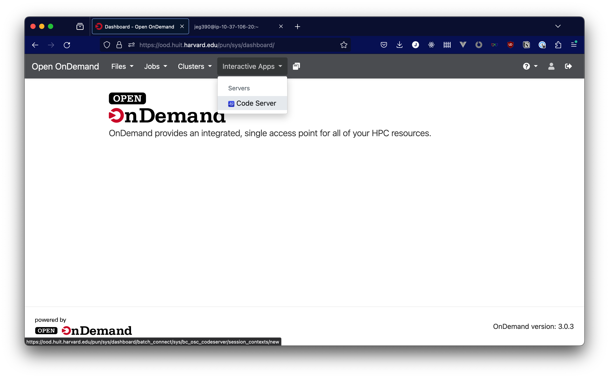
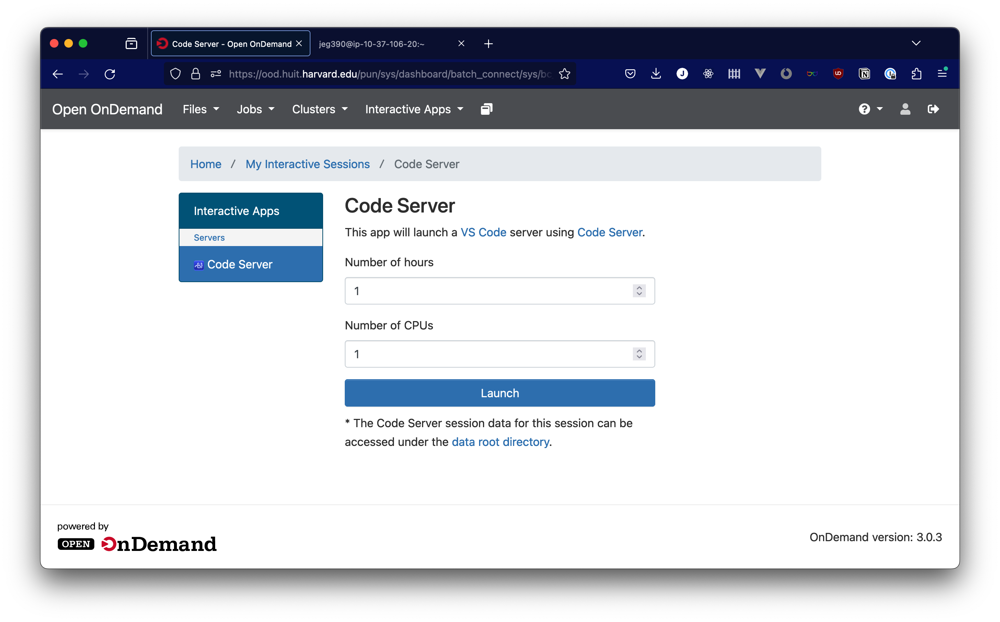
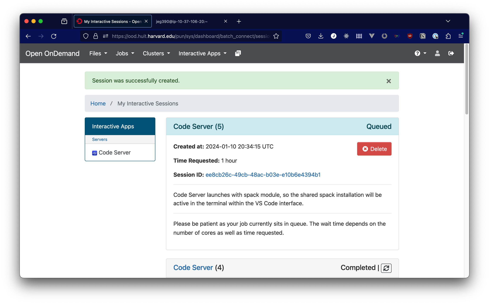
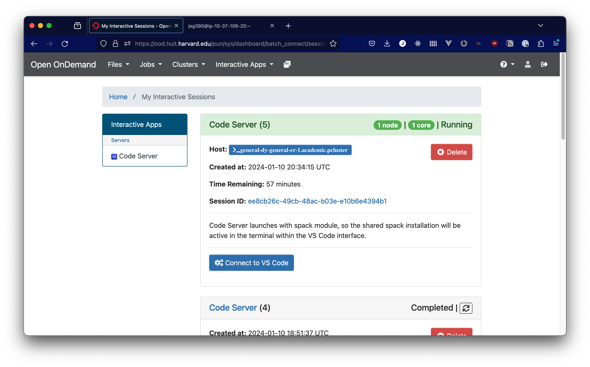
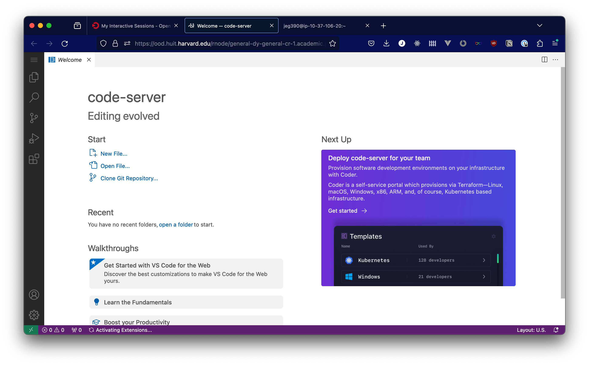

# VS Code App (Code Server)

We have added a Visual Studio Code app to the Open OnDemand interface, to provide a full-featured IDE with access to the cluster through your browser. You can set this app to run for a pre-determined amount of time, and can allocate up to 4 CPUs from the cluster to your interactive session (although we do ask that you do your best not to allocate more resources than you need).

To start, go to the "Interactive Apps" menu and select "Code Server"

You'll then be presented with some options for how many CPUs you need, and how long you expect to work for. Pick your options, then click "Launch"

You should see a screen like the screenshot below, where your Code Server session will appear queued. Depending on the resources available in the platform, your session may take several minutes to start as new compute instances are prepared for use.

Once your compute resources have been allocated and your environment is ready, you'll see that your session is "Running", and you'll have a button to launch. Click "Connect to VS Code" to access the VS Code interface.

Once you click the button to connect, you should be directed to a VS Code interface like this one. You shouldn't be prompted for a password, and if you are, that indicates an issue with how the VS Code app is working, so please reach out to support via [atg@fas.harvard.edu](mailto:atg@fas.harvard.edu)

## Slurm commands from VS Code interface

When in the terminal in VS Code, you have access to the same slurm commands that are available in the terminal that runs on the login node, accessible from the OnDemand dashboard. However, the commands may behave differently, since the VS Code interface is running as part of an existing slurm job. For instance, you cannot allocate additional CPUs via regular `srun` commands, beyond what the VS Code interface is already running. However, `sbatch` commands can dispatch jobs with additional resources from this context. If you find other problematic slurm behavior from the VS Code interface, especially if you have found a workaround, let us know by opening an issue in the repository for this documentation: [github.com/Harvard-ATG/huit-ondemand-user-docs/issues](https://github.com/Harvard-ATG/huit-ondemand-user-docs/issues)
